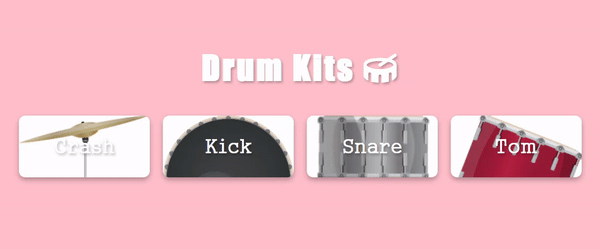

# Drum-Kits

## 효과
버튼을 클릭하면 악기 이미지에 해당하는 소리 발생   

## 학습  
### 1. CSS : white-space
공백 문자를 처리하는 법을 지정   

개행 문자	|스페이스, 탭	| 자동 줄 바꿈 |줄 끝의 공백
---|---|---|---|
normal |병합|병합|예|제거
nowrap |병합|병합|아니오|제거
pre |유지|유지|아니오|유지
pre-wrap |유지|유지|예|넘침
pre-line |유지|병합|예|제거
break-spaces |유지|유지|예|	줄 바꿈

### 2. JS : keydown 이벤트   
키를 누르면 시작  
문자 값 생성 여부에 관계없이 모든 키에 대해 시작  

*cf. keypress와 비교*
이벤트|의미|예
---|---|---|
keydown 및 keyup | 어떤 키를 눌렀는지 나타내는 코드를 제공 | 소문자 "a"는 65로 보고 (대문자 A는 모든 이벤트에서 65로 보고)
keypress | 어떤 문자가 입력되었는지 나타냅니다 | 소문자 "a"는 97로 보고

## 학습 출처 
- 유튜브   
https://www.youtube.com/@JavaScriptKing    

